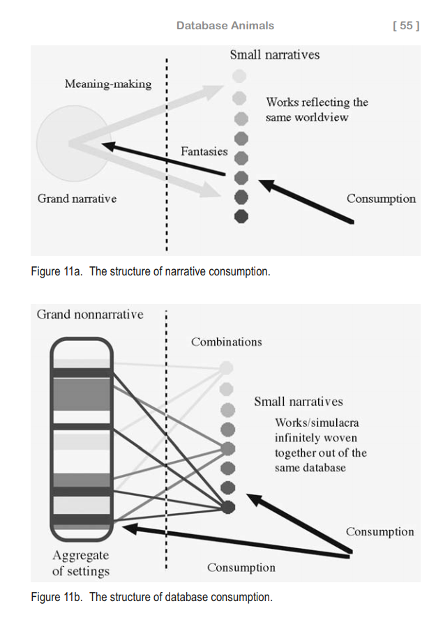

In the shift from modernity to postmodernity, our world image is
experiencing a sea change, from one sustained by a narrative-like, *cinematic perspective* on the entire world to one read-up by search engines, characterized by databases and interfaces. Amid this change,
the Japanese otaku lost the grand narrative in the 1970s, learned to
fabricate the lost grand narrative in the 1980s (narrative consumption),
and in the 1990s, abandoned the necessity for even such fabrication
and learned simply to desire the database (database consumption).
Roughly speaking, such a trend may be surmised from Ōtsuka’s critical
essay and my own observation. Figure 11 shows the difference between
narrative consumption and database consumption. Figures 11a and
11b correspond to the aforementioned Figures 3a and 3b, respectively.

(emphasis mine)

