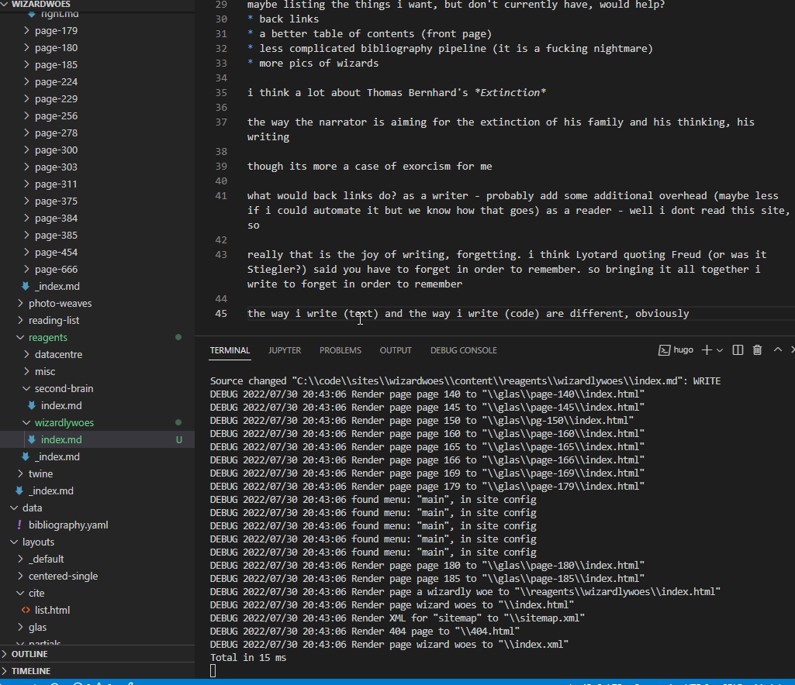

a problem i keep running into - wanting to expand site functionality

this usually involves one or more of the following:
* hack something together in hugo
* fight hugo and lose
* write a script outside of hugo to do whatever it is i'm trying to do (and remember to run it)

others discussing this 
* https://www.gwern.net/About
* https://maggieappleton.com/garden-history
* https://mrshll.com/mmx.html

part of the problem is that i want this site to be more for thoughts and reading

i dont need another engineer project

any time spent """programming""" is time i could be spending reading/thinking/writing

this is not to say that a more programmatic approach is wrong, just that i would prefer to focus on textual form

maybe listing the things i want, but don't currently have, would help?
* back links
* a better table of contents (front page)
* less complicated bibliography pipeline (it is a fucking nightmare)
* more pics of wizards

i think a lot about Thomas Bernhard's *Extinction* 

the way the narrator is aiming for the extinction of his family and his thinking, his writing

though its more a case of exorcism for me

what would back links do? as a writer - probably add some additional overhead (maybe less if i could automate it but we know how that goes) as a reader - well i dont read this site, so

really that is the joy of writing, forgetting. i think Lyotard quoting Freud (or was it Stiegler?) said you have to forget in order to remember. so bringing it all together i write to forget in order to remember

the way i write (text) and the way i write (code) are different, obviously

so the way i read the two is different, but i dont read the site
