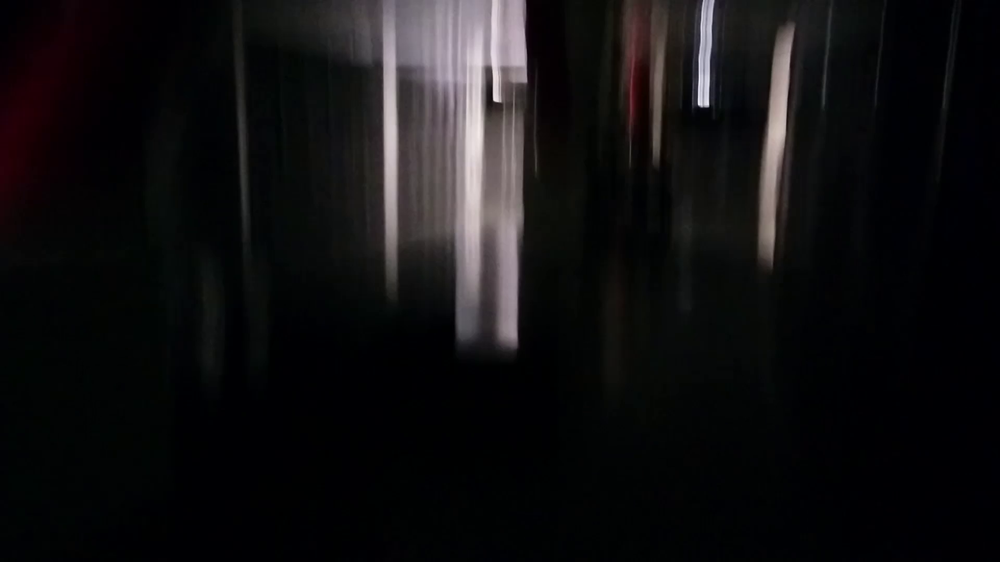



Could a depressed person make something like this?

Written, filmed, and edited entirely at my workplace during my time as a datacentre technician. Background sounds were stolen from youtube videos.

Same technical constraints as last time.

If *please. wait.* is concerned with how weird the situation is, *ghosts are just.* is not.

Cavernous and dark.

I knew what little audience *please. wait.* had attracted would not want to sit through another 3 minutes of datacentre footage. Even I didn't want to sit through another 3 minutes of datacentre footage.

Walkthroughs continued. I am pretty sure I had stop turning the lights on altogether. 

This one has a "story-within-a-story" form. Not sure how successfully that was conveyed.

The narrator was the same? Was there a third movie in this series planned?

Overall, I would give this film 5 bags of popcorn.