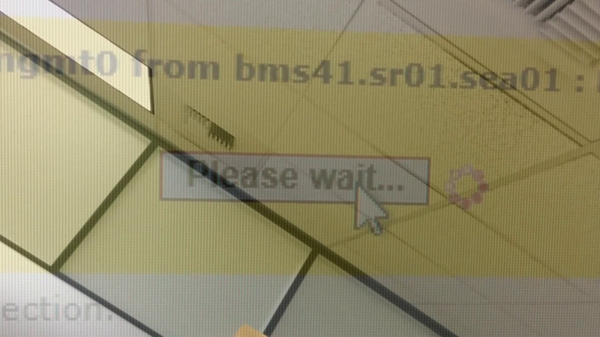



Written, filmed, and edited (though not necessarily in that order) entirely at my workplace during my time as a datacentre technician. I also did the music, but that was from an older project.
 
Night shift work meant a lot of my time was spent trying to find something to do. Watching movies turned into making movies.

Night shift work meant a lot of my time was spent 'reclaiming' servers. Unracking them, stripping them of components, placing them on the pile for day shift to deal with.  

Formally it is footage of different parts of the datacentre, with some text (bad poetry) to make the situation seem more fantastic (?) than it really is. 

We were required to do 3 walk through inspections of the datacentre during each shift. What this meant was walking around and looking for problems. You knew a server had issues because the LED was either 1) blinking when it wasn't supposed to or 2) not blinking when it was supposed to. Most coworkers use inspections as a 30 minute break. Much of the footage is of things seen during walk throughs, and then deemed notable by myself (for whatever reason).

Themes of waiting and disconnecting abound. I am not a subtle person.

Narrative? loosely, but I think most of it was just trying to make sense of how fucking weird (and boring) a datacentre is. Lots of motion and energy in a building thats only vaguely designed for the human caretakers. Sharing a desk with the person on the shift before mine (Swing) and the person after mine (Day), meant that none of it was mine. The ending was probably based on a "what if the datacentre caught on fire" joke.

The video is definitely the product of technical constraints. Shot on a cellphone camera, I made use of the crash carts and regular carts for anything like a dolly or tripod. The camera was never securely mounted, so I could only pull the carts backwards. Pushing a cart forward meant the camera would tip forward. It was a cool effect, and I used it in *ghosts are just.*. Otherwise footage was edited to run in reverse. Probably why the narrator never appears on camera, but maybe I didn't want to audience to identify with a character? Who knows.

I am pretty certain I was watching a lot of Godard's films during this time. *Histoire(s) du cinéma* and *Je vous salue, Sarajevo* are probably the biggest influences, though not in a theorectical sense, but simply that a movie can be clips and clips. *Alphaville: une étrange aventure de Lemmy Caution* appears too (as part of a datamoshed transition, already passe at the time).

I have watched some shorts by John Smith recently, and looking backwards I feel a small amount of validation.

Filming in a location where filming is forbidden is fun. I probably would have spun it as subversive even. Such a blatant act of wage theft. So thrilling to be fucking off on company time.

It is more likely that I wrote, filmed, and edited everything at work because that was the only time I had to do it. If I was not at work, I was asleep or getting ready for work.

Overall, I would give this film 5 bags of popcorn.

